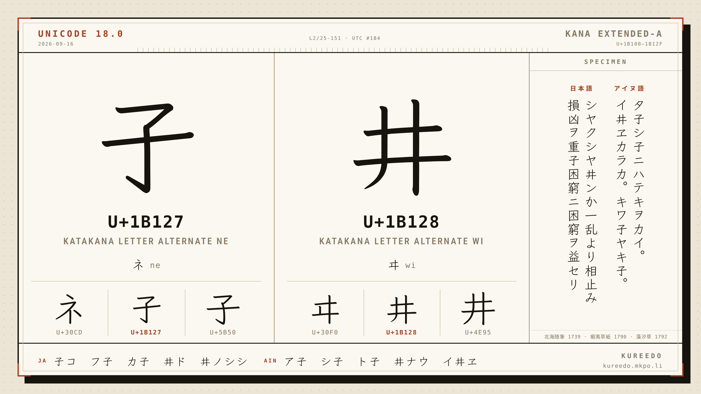
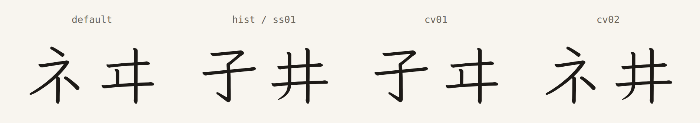
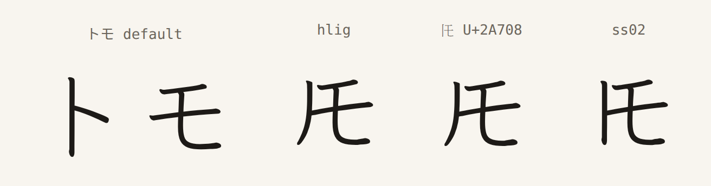
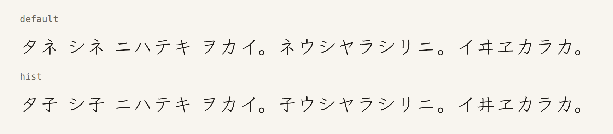
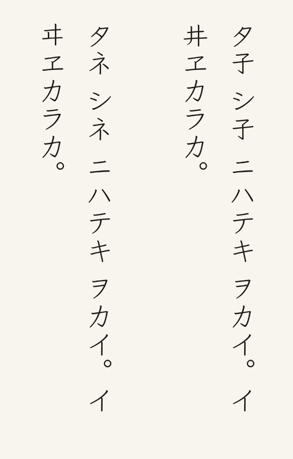
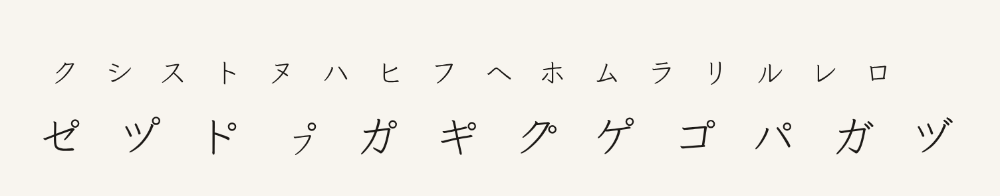
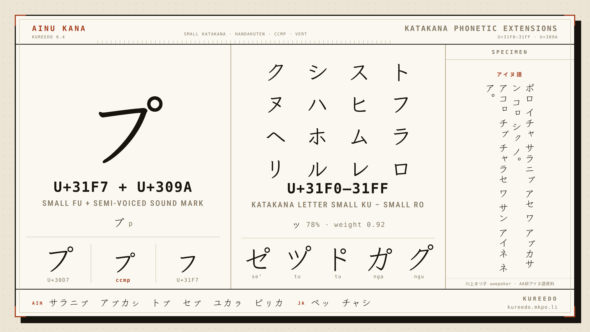
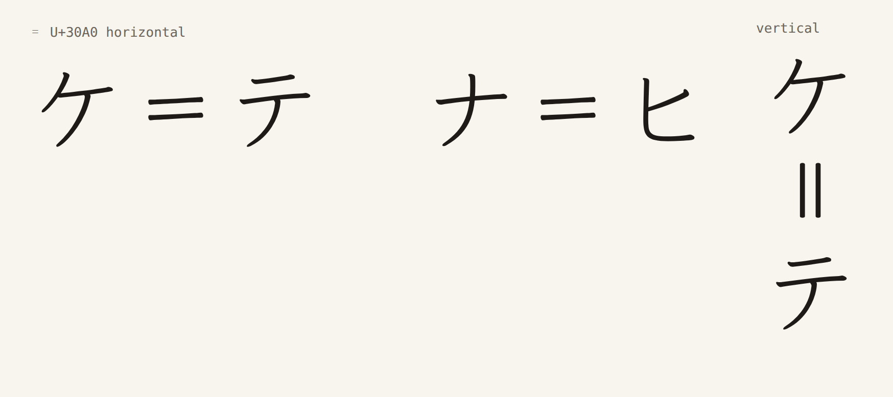
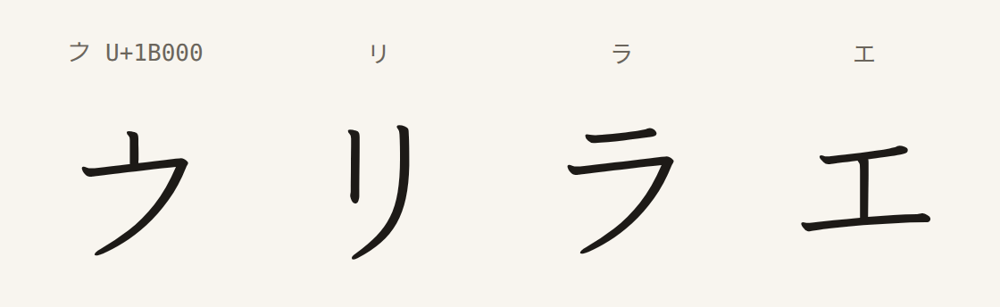

# Kureedo（クレード）

[](https://github.com/mkpoli/kureedo/releases/latest/download/Kureedo-Regular.ttf)
[](https://github.com/mkpoli/kureedo/releases/latest/download/KureedoKata-Regular.woff2)
[](OFL.txt)
[](https://www.unicode.org/charts/PDF/Unicode-18.0/U180-1B100.pdf)
[](https://www.jsdelivr.com/package/gh/mkpoli/kureedo)
[](https://kureedo.mkpo.li)

Klee One with the letterforms of Edo-period Japanese print, and the kana that Ainu needs. It covers two katakana that woodblock editions used and modern fonts lack: a ネ written like 子 and a ヰ written like 井. Unicode 18.0 encodes them as 𛄧 U+1B127 KATAKANA LETTER ALTERNATE NE and 𛄨 U+1B128 KATAKANA LETTER ALTERNATE WI, and the font covers those code points; the same glyphs are also OpenType alternates of ネ and ヰ, so a text encoded with the ordinary letters can show the historical forms through a feature. It also adds the small katakana ㇰ–ㇿ (U+31F0–31FF), the semi-voiced セ゚ ツ゚ ト゚ ㇷ゚ and the nasal カ゚–コ゚, which Klee One lacks.

Specimen, type tester and webfont CDN: https://kureedo.mkpo.li





The same editions set トモ as one letter, 𪜈 U+2A708. The font covers that code point, and the `hlig` feature forms the ligature from トモ. It also covers 𛀀 U+1B000, the archaic katakana e, and the double hyphen ゠ U+30A0.



Two fonts come out of one build:

| Font | File | Use |
|---|---|---|
| Kureedo | `Kureedo-Regular.ttf` | Desktop. The whole of Klee One Regular plus the historical glyphs, the extended kana and the features (8.7 MB). |
| Kureedo Kata | `KureedoKata-Regular.woff2`, `.ttf` | Web. Kana, kana punctuation and marks only (24 KB as WOFF2). Pair it with Klee One or another Japanese font for kanji and Latin. |

Download both from the [releases page](https://github.com/mkpoli/kureedo/releases); each release also carries `OFL.txt` and `SHA256SUMS.txt`.

Related typeface: [GenZui Serif / 源萃明朝](https://genzui.mkpo.li/), a Noto Serif JP derivative with hentaigana and historical kana.

## Using the fonts

On the web, either self-host the WOFF2:

```css
@font-face {
  font-family: "Kureedo Kata";
  src: url("KureedoKata-Regular.woff2") format("woff2");
  font-display: swap;
  unicode-range: U+3000-303F, U+3099-309C, U+30A0-30FF, U+31F0-31FF, U+1B000, U+1B127-1B128, U+2A708, U+1B124, U+1B125, U+1B122, U+1B121, U+1B126, U+1B155, U+1B164-1B168, U+1B120, U+1AFF0-1AFFE;
}
.edition { font-family: "Kureedo Kata", "Klee One", serif; font-feature-settings: "hist"; }
```

or load it from kureedo.mkpo.li. `/kureedo.css` follows the latest release; `/vX.Y.Z/kureedo.css` and the WOFF2 beside it are pinned and immutable, served with CORS and a one-year cache. The GitHub tags also work through jsDelivr (`https://cdn.jsdelivr.net/gh/mkpoli/kureedo@v0.4.3/fonts/KureedoKata-Regular.woff2`).

```html
<link rel="stylesheet" href="https://kureedo.mkpo.li/kureedo.css">
<link rel="stylesheet" href="https://kureedo.mkpo.li/v0.4.3/kureedo.css">
```

On the desktop, install `Kureedo-Regular.ttf` and pick it as the font. The historical forms come from the OpenType feature panel (Word: Font dialog, Advanced; LibreOffice: append `:hist` to the font name) or by typing U+1B127 and U+1B128 directly. ㇷ (U+31F7) followed by the combining handakuten U+309A gives ㇷ゚; セ゚ ツ゚ ト゚ and カ゚–コ゚ work the same way.

### Historical forms

Text encoded with the Kana Extended-A letters needs no feature. For text encoded with ordinary ネ and ヰ — which keeps search, sorting and copying working in software that has never heard of U+1B127 — the features below select the same glyphs.

| Feature | Effect |
|---|---|
| `hist` | All historical forms. |
| `ss01` | Edo-period printed forms. In this release the same set as `hist`. |
| `cv01` | ネ only. |
| `cv02` | ヰ only. |
| `hlig` | The digraphs from their letters (トモ → 𪜈 and the rest of the table above). Off by default, since not every トモ in a text is the ligature. |
| `ss02` | Straight left stroke for 𪜈; the default curves like 丿. Works with the encoded letter and with `hlig`. |





Klee One's own `hkna`/`vkna` alternates of ネ and ヰ also become the historical forms when a historical feature is on. In the full font, `hwid` and `ruby` keep Klee One's shapes and `aalt` lists the historical forms; Kureedo Kata carries none of those three features. Word processors list the character variants under their feature names; the fonts carry English and Japanese names.

## Coverage of Kureedo Kata

The subset requests U+0020, U+3000–303F, U+3099–309C, U+30A0–30FF, U+31F0–31FF, U+1B000, U+1B127–1B128, U+2A708, U+1B124, U+1B125, U+1B122, U+1B121, U+1B126, U+1B155, U+1B164–1B168, U+1B120 and U+1AFF0–1AFFE; code points Klee One does not cover (for example U+3031–3032, U+30FF) stay absent. `fonttools ttx -t cmap` lists the exact set, and the site shows it block by block. Glyphs Klee One does not have and this font adds: 𛄧 𛄨 𪜈 𛀀 ゠; the Ainu small kana ㇰ–ㇿ (U+31F0–31FF) and the small kana of Small Kana Extension — 𛅕 (U+1B155), 𛅤 𛅥 𛅦 𛅧 𛅨 (U+1B164–1B168) and, in the full font, the hiragana 𛄲 𛅐 𛅑 𛅒 (U+1B132, U+1B150–1B152) —, set the way Klee sets its own small kana (78% of the full-size letter, centred on the baseline, stroke weight brought back to 0.92 of the full-size stroke as Klee's own ッ and ァ keep it, shifted up and right in vertical text through `vert`); combining ゛ and ゜ with zero advance; and `ccmp` ligatures that set セ゚ ツ゚ ト゚ ㇷ゚ カ゚ キ゚ ク゚ ケ゚ コ゚ in one cell, horizontally and vertically. The handakuten of ㇷ゚ is scaled with the letter and sits where プ puts its own, at プ's clearance from the stroke; on the full-size bases it starts where Klee places the dakuten on the same letter and keeps that clearance (`scripts/mark_positions.py`, `docs/methods.md`).





## ゠ double hyphen

゠ U+30A0 uses two native Klee hyphen strokes rising 3°. Vertical text uses two straight uprights through `vert` or `vrt2`. The selected pair won seven of eight finalist comparisons; the complete ballot and decision are in `docs/votes/double-hyphen/`.



## 𛀀 archaic katakana e

𛀀 U+1B000 joins an upright head from Klee One’s リ to the lower stroke of ラ. The same outline serves horizontal and vertical text. It won five of six primary finalist comparisons and tied the sixth; the ballot and confirmed design are in `docs/votes/archaic-e/`.



## Sources of the forms

**ネ from 子.** The Edo-period printed katakana ネ keeps the shape of its source character 子: an angular upper turn, a sloping crossbar, an upright stem and a short curved hook. Reference specimen: 上原熊次郎『蝦夷方言藻汐草』(1792), volume 2, [image 81](https://dglb01.ninjal.ac.jp/iiif/ezomosio/002/tiff/ezmg002-081.tiff/full/1495,/0/default.jpg) (国立国語研究所, CC BY 4.0), with the [292 ネ samples](https://codh.rois.ac.jp/char-shape/unicode/U%2B30CD/) in CODH's kuzushiji index (日本古典籍くずし字データセット, 国文研ほか所蔵／CODH加工, doi:10.20676/00000340, CC BY-SA 4.0) as the wider comparison.

**ヰ from 井.** The printed ヰ of the same editions keeps the full 井 frame. Eiso Chan, *Proposal on two archaic Katakana letters*, [L2/25-151](https://www.unicode.org/L2/L2025/25151-katakana-ne-wi.pdf) (2025-05-23), page 1 and section 3, collects historical specimens of both letters; the UTC accepted it at meeting 184 and Unicode 18.0 encodes the two letters in [Kana Extended-A](https://www.unicode.org/charts/PDF/Unicode-18.0/U180-1B100.pdf) under the heading Historic Katakana. They are separate letters from 子 U+5B50 and 井 U+4E95, and have no decomposition to ネ or ヰ.

**𪜈 from ト and モ.** The default has a curved 丿-like left stroke joined to モ. Its upper and middle bars rise 9° and 8° respectively; their contours retain Klee One’s pen terminals. `ss02` uses a straight left stroke with the same モ. The proportions follow the Unicode code chart glyph for [U+2A708](https://www.unicode.org/charts/PDF/U2A700.pdf) (source JK-65004) and the printed instances in 池田霧渓『種痘弁義』(1858), [image 6](https://dl.ndl.go.jp/api/iiif/2539156/R0000006/full/full/0/default.jpg) (国立国会図書館, [doi:10.11501/2539156](https://doi.org/10.11501/2539156), public domain), located through the みんなで翻刻 transcription ([honkoku-data v3](https://github.com/yuta1984/honkoku-data), CC BY-SA 4.0). The print sets the left stroke no taller than the モ and joins the bars to it; the code chart leaves them apart. The selected font outline joins the middle bar to the left stroke.

**𛄤 from ト and キ.** ト's upright, shortened as in 𪜈, beside キ compressed to 0.72 of its width.

**𛄥 from ト and テ.** The same upright beside テ compressed to 0.72.

**ヿ from コ and 于.** コ without its bottom bar; the foot of the upright takes the hook of Klee's 于, sheared to コ's slant.

**𛄢 from 于.** Klee's own 于, scaled to 0.86 with the stroke thickened back to full weight; the letter derives from 宇 and the code chart draws it as 于.

**𛄡 from ヽ and エ.** Klee's ヽ at 0.6 over エ at 0.88, both thickened back; the code chart draws the letter as エ with a short slanting stroke at the upper left.

**𛄦 from ヨ and リ.** ヨ compressed to 0.7 on the left; リ's long stroke on the right.

**𛄠 from ト and ノ.** An upright with a sweep to the lower right from its middle and a short stroke to the lower left, as the code chart draws it: ト's upright, ノ mirrored at 0.6 for the sweep, ノ at 0.3 for the tick, both grown to Klee's weight.

**𚿰–𚿾, the Minnan tone letters, from Klee's strokes.** Each mark after the code chart, a Klee stroke scaled down and set at the centre of the cell: ノ for tone-2, ヽ for tone-3, 丶 for tone-4 and tone-8, く for tone-5, ト's upright for tone-7; the nasalized ones carry ゜ at 0.45 below the mark. Full-width cells; first assemblies.

**𛄣 from こ and と.** Full font only: こ over と at 0.62, as the digraph stands in a column; `hlig` forms it from こと.

**𛄟 from け and 于.** Full font only, provisional: the letter is cursive 宇; け's left stroke with Klee's 于 at 0.5 as the hooked right part.

The 0.2 ヰ outline keeps Klee's uprights and stroke ends and sets the bars 50 units closer, the upper 30 and the lower 60 units longer; it beat the 0.1 outline and the other finalists in blind comparison. `docs/methods.md` describes how each form was chosen, including the small kana and the mark positions, and `docs/votes/` holds the comparison records.

## Building

```sh
python -m venv .venv
.venv/bin/pip install -r requirements.txt
.venv/bin/python scripts/build.py
.venv/bin/python scripts/check.py
```

The build downloads Klee One Regular from the pinned commit of [fontworks-fonts/Klee](https://github.com/fontworks-fonts/Klee) (`8b05327`) and verifies its SHA-256 before use. `sources/glyphs/` holds the historical outlines as SVG in a 1000-unit em, y down, em top at y=880. `check.py` shapes the built fonts with HarfBuzz: default glyphs, every feature in both writing directions, mark composition, small-kana vertical origins, and byte identity of every Klee One glyph in the full font. `specimen/index.html` shows the result. `site/` holds the specimen site and CDN at kureedo.mkpo.li; `site/README.md` describes how a release is published there.

## Licence

The fonts are licensed under the SIL Open Font License 1.1 (`OFL.txt`). Klee One is Copyright 2020 The Klee Project Authors; Klee is a trademark of Fontworks Inc., and Kureedo is an independent derivative with no connection to Fontworks. The historical outlines and the scripts in this repository are Copyright 2026 The Kureedo Project Authors; the scripts are released under the MIT License (`LICENSE-scripts.txt`).

## Author

まくぽり / mkpoli — https://mkpo.li
