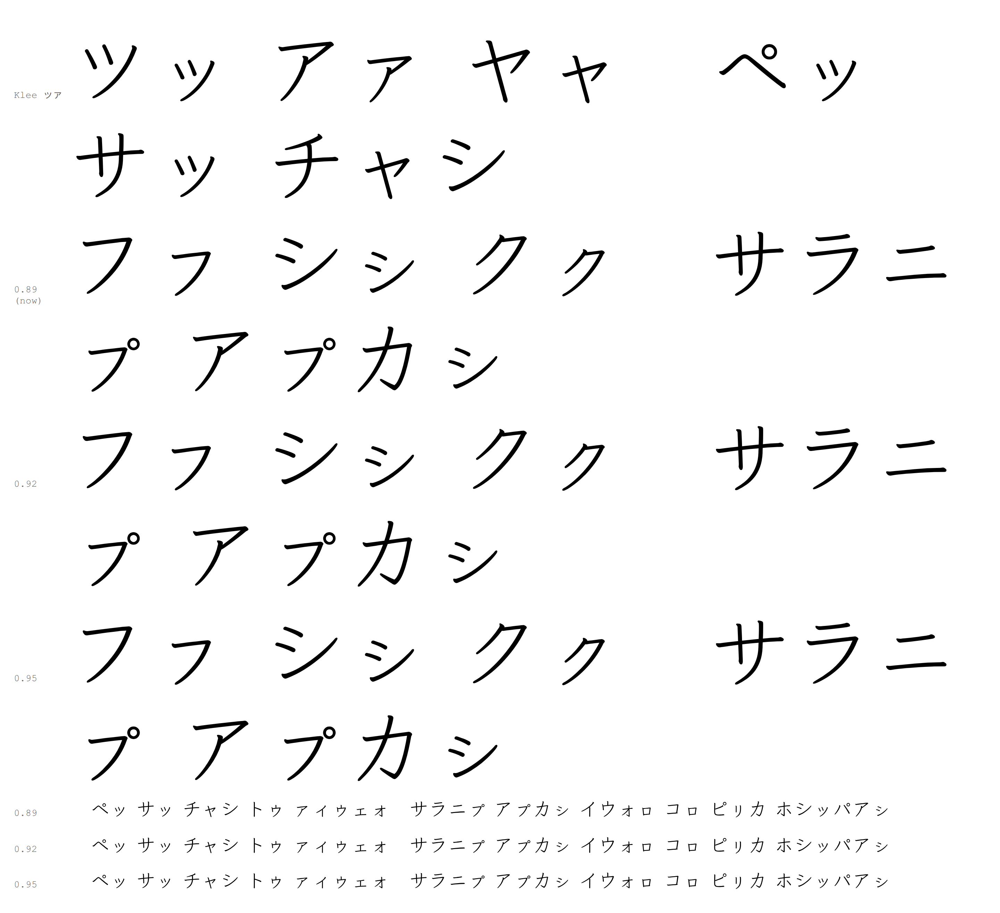
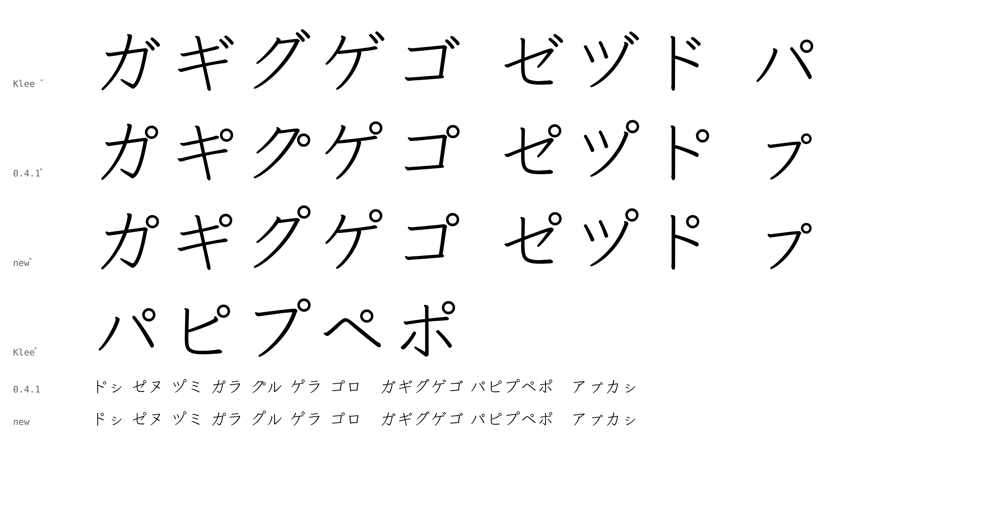
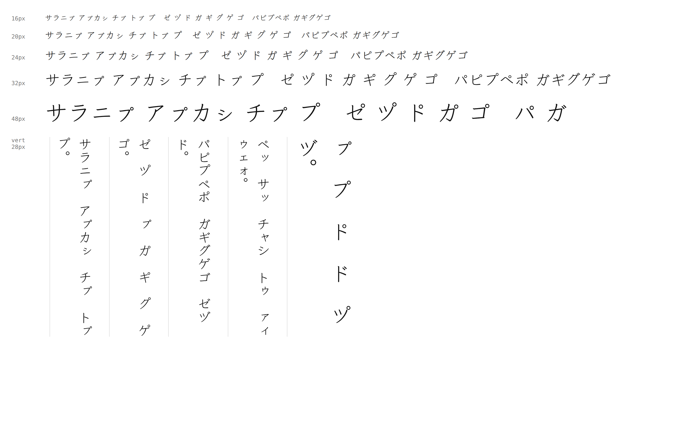

# How the forms were chosen

Since Unicode 18.0 the two letters have their own code points, 𛄧 U+1B127 and 𛄨 U+1B128 in Kana Extended-A. The font covers them and keeps the same glyphs reachable from ネ and ヰ through `hist`; which encoding a text uses is the text's decision, not the font's.

Each historical glyph is drawn from Klee One's own strokes so that it sits beside Klee's kana at reading size, then chosen among candidates by blind pairwise comparison. The comparisons say which candidate one reader prefers in running text; the historical sources named in the README say what the letter looked like. The two kinds of evidence are kept apart.

## Comparison protocol

- Candidates are built as separate fonts differing only in the glyph under study. Each carries a random identifier; the designer's construction notes are sealed until a round ends.
- A comparison shows two candidates side by side in the same passage of Moshiogusa transcription, horizontal and vertical text together, at 24 px. The options are A, B, tie, and neither. Sides and passages are shuffled; some pairs repeat with sides reversed.
- One judge (the project owner) records every vote. The records in `votes/` are that judge's ballots; they measure one reader's preference, not agreement among readers.
- Ranking counts one point per win and half a point per tie, excluding repeat judgments.
- From the fifth ネ round on, a regularized preference model (a Davidson model with a separate "neither" outcome, fitted to rasterized outlines) screened weak candidates before a round and proposed the next pairs. Its predictions were never shown while voting, and the final choice in every round rests on the recorded votes, not on the model.

## ネ

Six rounds. The first fixed stroke weight against Klee's own kana; the middle rounds varied the length ratio of the horizontals, the height of the crossbar, the centre of gravity, the shape and length of the hook, and the central white space. Very small variations were hard to judge and forms that changed the basic shape were rejected; the productive range kept the shape and curvature and exchanged native stroke parts and their positions.

The final round (`votes/ne/arena6-judgments-71.json`, 16 candidates, 71 judgments) ended with candidate `ffcd7b08b3cea47d5`: seven wins, one loss and two ties in ten non-repeat finalist comparisons (`votes/ne/arena6-decision.json`). Its outline is `sources/glyphs/ne.svg`; the other fifteen are in `votes/ne/arena6-candidates.svg`.

## ヰ

Eleven rounds. The first four built and screened the frame (records below); the released 0.1 glyph was the leader of round 4. Rounds 5–11 refined it on the same four strokes, varying only the geometry of the two bars and, briefly, the frame.

1. Ten forms assembled from Klee stroke components on the 井 frame. Set aside after a printed proof: the printed sources suggested starting from Klee's own ヰ instead.
2. Ten forms starting from Klee's own ヰ, varying only the left stroke. Rejected: the two horizontal bars sat too far apart.
3. Spacing study: eight forms that close the gap between the bars by increasing amounts, everything else fixed (`votes/wi/spacing-study-31.json`, `votes/wi/spacing-candidates.svg`).
4. Component study: 24 forms varying bar length, vertical placement, horizontal offsets and upright spacing (`votes/wi/component-screening-54.json`, `votes/wi/component-candidates.svg`, `votes/wi/shortlist-batch-29.json`). Its leader (bars 60 units closer than Klee's, lower bar 110 units longer) shipped as 0.1.
5. Compression towards the printed proportions — shorter uprights, level bars, tighter gap. Rejected outright: 37 of 42 judgments "neither", the five decisive ones all for the unchanged 0.1 outline (`round5-*`).
6. The two bars alone, 18 forms (`round6-*`): forms whose bars differ less in length than 0.1's led; opposite horizontal offsets lost every comparison.
7. A directed block of 14 named contrasts (`round7-*`): the bars' native length difference beat both a smaller and a larger one; moderate combined length beat long; a wider gap (30 closer than Klee) beat 60 closer, which beat 90.
8. Gap bracket (`round8-*`): Klee's own spacing lost twice; 30 and 60 closer were not separable; raising the bars was rejected.
9. Set aside unjudged.
10. A Latin-hypercube sample of 24 forms over the eight parameters plus two anchors, 58 judgments (`round10-*`). A Davidson preference model with a separate rejection term, fitted on rounds 6–8 and 10 (106 judgments, five folds grouped by pair), predicted the preferred side in 44 of 65 held-out decisive choices; it favoured raised bars, a moderate gap and a shorter lower bar (`parameter-model.json`).
11. Confirmation (`round11-*`): the model's optimum with its bars raised lost to 0.1, while the same form unraised beat 0.1 and tied or beat the round-7 winner.

The 0.2 glyph is that unraised form (`w62de2d979979dc14`): upper bar 30 units longer and lower bar 60 units longer than Klee's, bars 50 units closer, uprights and stroke ends unchanged. Each round's ballots, design parameters and candidate outlines are in `votes/wi/`; every candidate id resolves to its outline in the matching `-candidates.svg`.

## ㇷ゚ and the small kana

Kureedo 0.2 and 0.3 set the sixteen small kana ㇰ–ㇿ at 65% of the full-size letter, pushed to the lower right of the cell, and composed ㇷ゚ with the full-size handakuten at its full-size position, so the circle floated above a small フ. Klee One's own small kana (ッ, ァ) are about 78% of full size, horizontally centred on the baseline, and move up and to the right in vertical text; they also keep about 0.9 of the full-size stroke, which plain scaling does not.

The rounds are in `votes/pu/` (`roundN-designs.json` maps each candidate id to its build parameters; `pu-space.png` plots the round 12–13 variants).

12. Latin-hypercube sample of 22 forms over scale, alignment, lift, vertical placement and the mark's scale and position, plus the 0.2 form and Klee's ッ convention (`round12-sample-54.json`). 29 of 54 judgments "neither": every form was too thin beside Klee's ッ. Measured, Klee's small kana keep 0.9 of the full stroke while scaling to 0.77 left 0.77–0.84. The build now thickens each scaled glyph back to 0.9 (a dilation of the outline).
13. The same design with weight restored and narrowed ranges (`round13-partial-19.json`), stopped at 19 judgments: all sampled mark positions sat 45–200 units above the small letter's top, and none was acceptable.
14. Directional ladder on the mark's height from a プ-analogue (プ scaled as ツ→ッ), two "neither" votes (`round14-markDy-2.json`). The analogue's mark position had been taken from the mark glyph's default placement, drawn for ト゚, which put the circle 87 units below フ's top edge.
15. Eight-axis ladder batch of 39 forms, judged by a cull instead of pairs: 38 rejected on sight, one kept, with the note that the circle overlapped the stroke (`round15-cull-38of39.json`).
16. Measured on Klee's プ, the handakuten centre sits 90 units right of フ's right edge and 49 above its top with 24 units of clear space; the mark is now placed by clearance along that direction, measured on the weight-restored outlines. Ten forms, cull then ladder (`round16-ladder.json`): clearance 19 (プ's 24 scaled to the small letter) beat 32 and tied with 10; a mark at 1.15× the letter's scale beat 1.0× twice and lost the swapped confirmation; プ's direction beat 0° and 60°.
17. Six forms around that winner (`round17-ladder.json`): clearance 19 beat 14 and 24; the mark at 1.0× beat 1.15× twice; a 40° direction tied with プ's.

The 0.4 setting is candidate `p7efd533ab1941192` of round 17: small kana at 78%, centred, stroke weight 0.9, vertical top at 329 units with a 130-unit shift right; the handakuten at 78% with its centre 71 units right and 39 above the small letter's top-right corner.

### Stroke weight (0.4.1)

Measured against Klee's own pairs, the small kana keep 0.89–0.95 of the full-size stroke (ッ/ツ 0.89, ァ/ア 0.92, ェ/エ 0.93, ヶ/ケ 0.95; median 0.92), while the 0.4.0 build's nominal 0.9 came out at 0.88–0.90 because a dilation by r adds a little less than 2r to the measured stroke once the corners round. 0.4.1 targets 0.92 and solves the dilation radius on the measured result, so every small kana and the scaled handakuten sit at 0.92 ± 0.01. 

A morphological opening to retract the tapered terminals (which Klee draws shorter and plumper on ッ and ァ) was tried at radii up to 10 units: below the thinnest stroke's half-width it changes little, above it it eats ㇰ, so the terminals stay as scaled; shortening them by hand remains open.

### Handakuten on the full-size bases (0.4.2)

セ゚ ツ゚ ト゚ カ゚ キ゚ ク゚ ケ゚ コ゚ had their marks placed by hand offsets from the mark glyph's default position; ク゚'s ring sat inside the letter's height and ト゚'s hung far to the right. `scripts/mark_positions.py` now derives them from Klee One: the ring starts where Klee places the dakuten on the same base (ガ ギ グ ゲ ゴ ゼ ヅ ド), moves by the mean offset between Klee's own handakuten and dakuten on ハ–ホ (−11, +12), and is pushed straight away from the letter until it has プ's 24 units of clearance. `check.py` asserts that clearance.

A second review of these proofs (2026-09-20) found the ㇷ゚ ring right at 16–32 px and the vertical placement sound, and noted the terminals: Klee's own small kana end shorter and blunter than the scaled letters, most visibly on ㇱ ㇷ ㇰ. An automatic retraction was tried and rejected (it cannot tell a stroke's entry from its end), and a side-by-side at 360 px was judged not worth a hand pass for a text face; the terminals stay as scaled.

## 𪜈

The default outline is the curved-left form `teb69161684d0b4bc` from comparison round 19. Its モ bars rise 9° at the top and 8° in the middle. The left stroke meets the middle bar and reaches only slightly above the upper bar. `ss02` selects the paired straight-left form; the モ contours and cell metrics are the same. Both outlines are in `sources/glyphs/`.

Twenty-two of 25 forms survived the cull. Fifty screening judgments led to four finalists, compared in horizontal and vertical reading text at 24 px. The final stage contained 12 primary comparisons and three repeats. With a win worth one point and a tie half a point, the selected form scored 4.5/6; the others scored 3, 2.5 and 2. Only one of the three repeat judgments agreed exactly, so these results establish a practical choice rather than a precise preference estimate. The ballots, scores and selected design are in `votes/tomo/`.

## ゠

Two rounds compared paired horizontal and vertical forms in synthetic Japanese passages at 24 px. Round 1 retained four horizontal shapes made from Klee One’s fullwidth hyphen. Round 2 varied their slope and paired them with independently sized, strictly straight vertical strokes made from Klee’s fullwidth upright.

Candidate `dda98e623ad2d77af` won seven of eight primary finalist comparisons, against six of eight for the runner-up. It won both direct comparisons against the runner-up, and all three finalist repeats agreed. Repeats are excluded from ranking. The complete 45-judgment ballot, all round-2 designs and the decision are in `votes/double-hyphen/`. These judgments record one reader’s combined preference for the two writing directions.

The horizontal strokes rise 3°, with nominal length 560 units and stroke-center separation 160 units. The vertical strokes are 560 units long and 51 units wide, with centers 160 units apart. Native stroke ends are retained. `double-hyphen.svg` and `double-hyphen-vert.svg` are the selected outlines; `vert` and `vrt2` select the vertical form. Both forms occupy one 1000-unit cell with vertical origin 880.

## 𛀀

The selected form joins Klee One’s リ-derived upright head to the unchanged lower ラ contour. Its stem attaches at x=490, rises 190 units above the bar and has no added lean. The head retains its native outline; the shaft extends into the bar to form one connected contour. The same glyph occupies one 1000-unit cell in both directions, with vertical origin 880.

Twenty-seven forms survived the last cull. The 73 judgments comprise 52 primary screening comparisons, six screening repeats, 12 primary finalist comparisons and three finalist repeats, all with horizontal and vertical reading samples shown together at 24 px. Candidate `e47e03ce8e8297cc1` won five of its six primary finalist comparisons and tied the sixth, scoring 5.5/6. The other finalists scored 2, 2 and 1.5 out of six. Repeats are excluded from ranking. None of the nine repeat judgments agreed exactly with the first judgment, so the result supports a practical selection with limited repeat consistency. Including repeats leaves the same candidate first. The ballot, designs, scores and outline hashes are in `votes/archaic-e/`.

## Other letters

Assembled the same way, not yet compared:

- 𛄤: ト's upright (as in 𪜈) beside キ compressed horizontally to 0.72 about its centre and moved 70 units right.
- 𛄥: the same upright beside テ compressed horizontally to 0.72 about its centre and moved 70 units right.
- ヿ: コ cut below y=170 (its bottom bar removed); the hook of Klee's 于 (y<101), sheared by 0.14 to コ's slant, moved (175, 70) to the foot of the upright.
- 𛄢: Klee's 于 scaled uniformly to 0.86 about (510, 330), then grown by 4.3 units so the stroke keeps Klee's weight.
- 𛄡: ヽ scaled to 0.6 and moved (−200, 165); エ scaled to 0.88 and lowered 40; both grown to Klee's stroke weight.
- 𛄦: ヨ compressed horizontally to 0.7 about its centre and moved 70 left; リ's right stroke (x>430) moved 150 right.
- Small Kana Extension (𛅕, 𛅤–𛅨, and the hiragana 𛄲 𛅐 𛅑 𛅒): the full-size letter through the same small-kana setting as ㇰ–ㇿ; 𛅨 is the assembled 𛄡 and follows whatever its comparison decides.
- 𛄠: ト's upright shortened 60/60; ノ mirrored and scaled to 0.6 leaving the upright 0.55 of the way up; ノ at 0.3 leaving it 0.3 of the way up; strokes grown to Klee's weight.
- Minnan tone letters: ノ at 0.45, ヽ at 0.55, 丶 at 0.55 and 0.4, く at 0.45, ト's upright at 0.5, each grown to Klee's weight and centred; nasalized forms add ゜ at 0.45 twenty units below the mark, the pair centred. Provisional.
- 𛄣: こ over と, each scaled to 0.62 and grown to Klee's weight, 10 units apart, the pair centred on the kana body.
- 𛄟: け cut at x<420 (its left stroke); 于 scaled to 0.5, grown to Klee's weight, set 70 units right of it. Provisional.
- 𬻿: ヽ scaled to 0.5 over し cut below y=300 and stretched horizontally to 1.5; 60 units apart; centred.
- 𬼀: Klee's メ scaled to 0.92 about its centre, grown to Klee's weight.
- 𬼂: Klee's レ scaled to 0.95 about its centre, grown to Klee's weight.
